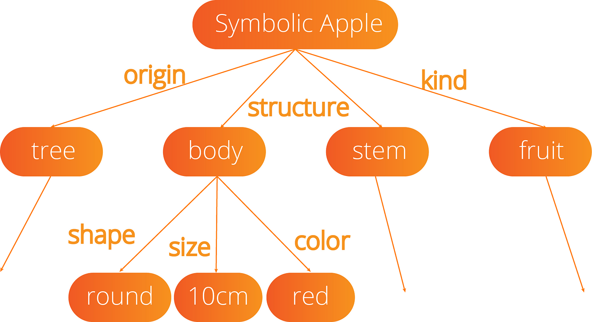
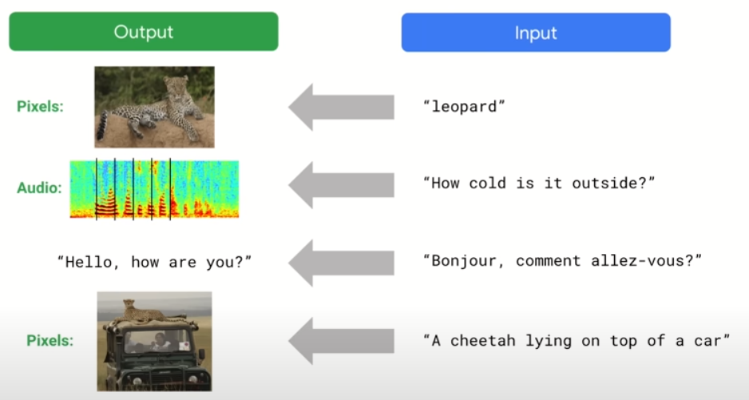

# SLUUG Talk: Large Language Models

This repository contains the slides and code for the talk:

- Demystifying Large Language Models (LLMs) on Linux: From Theory to Application

It was given for the St. Louis Unix Users Group (SLUUG) on 2024/2/22 @ 6:30 PM CST.

- SLUUG: https://www.stllinux.org/ :link:

- Meetup: https://www.meetup.com/saint-louis-unix-users-group/events/290697932/ :link:

---

# Alex Towell

- lex@metafunctor.com :email:
- https://metafunctor.com :link:
- https://github.com/queelius :rocket:
- https://twitter.com/queelius :bird:

- Important URLs for this talk:
    - Talk link: https://github.com/queelius/sluug-talk-llm :link:
    - Colab notebook on n-gram model: https://colab.research.google.com/drive/1ak4kOtbIQGXE5kuhhGTd55xu4qRpeZd7?usp=sharing
    - ElasticSearch NLQ demo (down): http://lab.metafunctor.com:6789 (API: http://lab.metafunctor.com:6789/docs)

---

# Outline of Talk

- Theoretical Background

- Go over a simple language model
    - $n$-gram model (Jupyter Notebook)
    - Easy to understand and helps us understand some aspects of LLMs.

- Show an application of LLMs:
    - Try to make a database search API intelligent (NLP)
    with small LLMs.

- Open Discussion

---

# Good-Old-Fashioned AI (GOFAI)

- Find a way to symbolically represent the problem and
  then use logic or rules to solve it.

    - Programming :computer:

    - Rule-based systems :robot:

    - First-order logic

- LLMs are *good* at using these tools. :hammer:

    - Integrate Prolog with LLM tool-use to help with planning and reasoning?

---
### Reductive Reasoning



GOFAI works for a lot of problems we care about:

- Filter everything through our small working memory.
    - Inductive bias: Makes assumptions about the world.
    - Help us generalize out-of-distribution. :brain:
- Take big problems and break down into simpler problems.
- Solve simpler problems and combine.

---
# Limits of GOFAI

Many problems are hard to break down into simpler parts.

- Whole greater than the sum of its parts.

- Too complex to solve reductively.
    - We can't program computers to do it. :shrug:
    - Identifying cats in pictures? :cat:
    - > The hard problems are easy and the easy problems are hard.
        -- Steven Pinker
    - Playing with legos is hard but multivariate calculus is easy (for a computer).
---
# How Do Our Brains Work?


Brains programmed by evolution to survive in a complex world.

- It's a prediction engine: it learns to predict the world.
- The unconscious mind is not limited by a small "working memory"
- It can do things we don't understand how to do.
- Brain is a black box. (See: *Interpretable ML*)

---

# Machine Learning

:bulb: Let's have the computer learn from data.

- Since the real world is too complex, let's have the computer learn from data like we do.

- There are three main types of learning.

    - Supervised Learning (SL)
    - Unsupervised Learning 🔥
    - Reinforcement Learning (RL) 💣

- _Spoiler_: LLMs use self-supervised learning (SSL) and RL (RLHF).

---

## Type of Learning (1): Supervised Learning

**Learning from labeled data**. We have some input and output data, and we want to learn how to map the input to the output.

- Given an (unknown) function $f$ and a set of input-output pairs $(x, f(x))$, learn a function $\hat{f}$ that approximates $f$ on the input-output pairs.

- E.g., classification: $f$ : [ :cat: or :dog: ] ↦ { :cat: , :dog: }.

    - Use $\hat{f}$ to predict :cat: or :dog: for new images.

- Easiest problem to solve in ML. But: limited by data.

- **Fine-Tuning** LLMs is supervised learning: improve it on specific labeled tasks.

---
## Type of Learning (2): Unsupervised Learning

**No labeled data**. Learn the underlying structure of the data.

- Clustering: Grouping similar data points. (See: *RAG*)

- Dimensionality Reduction: Learn *efficient* representations of the data.
    - Very hard and one of the most important problems in ML.

- Density Estimation: Stochastic estimate of process that generated the observed data. Say the process generates $(x, y)$ pairs and we estimate its density $\Pr(x, y)$.
    - Classification (supervised): $\Pr(y|x) = \Pr(x, y) / \Pr(x)$

- **Pre-training LLMs** is like unsupervised learning. Learn a good representation and probability distribution of the *raw* text using self-supervised learning (SSL).

---

## Final Type of Learning (3): Reinforcement Learning

This is an agentic approach to learning. Agent interacts with environment and learns from the rewards it receives.
- *Goal*: maximize the expected sum of rewards.
- *Spoiler*: Agentic frameworks that include LLMs as a prediction component is a very active area of research.
- `Prediction + Search = Planning`
    - Counterfactual reasoning
- Hypothesis: `Compression = Prediction = Intelligence`
- Big reason a lot of people are excited about Sora.
    - Has everyone seen the Sora videos?
    - "Intuitive" world simulation (embedded in the weights of a giant NN).    

---

# Early Failures in ML

Early efforts in ML were not very successful. Reality is complicated:
$$
(x_1, x_2, \ldots, x_n),
$$
$n$ extremely large and each $x_i$ some complex object.

- Overfitting, curse of dimensionality, lack of data/compute.

- To combat lack of data/compute, clever solutions developed.

- Many of these methods are no longer around.
    > "The biggest lesson that can be read from 70 years of AI research is that general methods that leverage computation are ultimately the most effective, and by a large margin."
    -- Richard Sutton's Bitter Lesson
---

# Neural Networks


Neural Networks (NN) are one the solutions that stuck around.

- It fell out of favor for a while, but it's back.
- Universal function approximator.
    - Can learn to represent any function.
    - But: need a lot of data to do so and be difficult to train.
- NNs seem to scale to as much data and compute as we can throw at them.

---
# Inductive Bias

Observations may have an infinite set of hypothesis that are compatible with the data.

- **Inductive Bias**: The set of assumptions that the model makes about the data.

- **Occam's Razor**: choose the simplest hypothesis that is compatible with the data. (See _Solomonoff Induction_.)

- Generalizing out-of-distribution (OOD) from inputs not in the training data.

- **Problem**: We are almost *always* out-of-distribution.
    - Except in toy problems (see: early successes)

- Good inductive biases are necessary for generalization.

- **No Free Lunch Theorem**: No model is optimal for all tasks.
---

# Era of Deep Learning


One of the hardest parts is learning sample efficient representation of the data.

- Layers of NN learn progressively higher-level representations: `Pixels -> Edges -> Objects`

- AlexNet (2012) was the first to show that deep learning could work well on large-scale datasets.

---

# Era of Deep Learning (cont.)


DNNs (feed-forward) learn little circuit programs that can generate parts of the training data. (Image stolen from Jeff Dean's slides.)

- Hundreds of layers: can learn pretty complicated programs.

- (What a human can do in a half a second, a DNN can do?)


---
# Era of Generative AI



Generative AI "reverses" the arrows
    - Image to text, image to image, etc.

- They learn something about the data generating process (DGP).
- They have completely changed our expectations of what computers can do.

---
# Era of Generative AI (cont.)

We now have computers that can see, hear, understand, and generate all of these things.

Let's go look at **Sora**: generative video, or world(s) simulator?

- **Scaling**: And increasing the scale (data, compute) increase their capabilities. See: Scaling laws.

    - Need a lot more *compute*.
    - It's going to get wild(er).
    - Hypothesis: `Prediction = Compression = Intelligence`.


---
# Large Language Models (LLMs)

Autoregressive (AR) models learn a probability distribution over training data by using self-supervised learning (SSL):

$$
\Pr(x_1, x_2, \ldots, x_T) = \prod_{t=1}^T \Pr(x_t | x_1, \ldots, x_{t-1})
$$

- This is hard to learn, but with enough data and compute, a lot seems possible.
- LLMs have a nice advantage since language is designed to have a very low dimensionality and have a high signal to noise ratio.
    - Representation learning is easier in language than in other domains.
        - Still learns representations (`word2vec`)
- **Language** represents much of the things that humans care and think about, so learning to predict it is a kind of general intelligence. (See: Sparks of AGI by Microsoft)

---

# Sampling from LLMs

There are many different ways to sample from LLMs and change the behavior of the model.

- **Temperature**: Rescaling the logits before applying the softmax function.
    - $T = 1$: estimates the probability distribution.
    - $T < 1$: reduces randomness, i.e., more predictable outputs.
    - $T > 1$: increases randomness, i.e., more unpredictable outputs.

Good for controlling *exploitation* vs *exploration* if repeatedly sampling from the model to generate new or different outputs.

- **Top-k and Top-p Sampling**: Choose the top-$k$ or top-$p$ tokens and sample from them.

- **Beam Search**: Explore multiple paths and sample based on that joint probability.

---
## Prompting Strategies

Early models were very sensitive to the prompt.
- Makes sense, they were trained to generate the data.
- If you condition on crazy data, you get crazy outputs.

$$
\Pr(\text{more crazy}|\text{crazy})
$$

Various prompting strategies have been developed to help the model generate more reliable outputs:

- Chain-of-thought (CoT)
- Tree-of-thought (ToT)
- and so on...

---

# LLM Overview

Basic idea: train a model to predict the next token in a sequence of tokens.

- **Task**: Given a sequence of tokens, predict the next token.
    - Pre-Train model to learn raw data distribution using SSL.
    - Fine-tune model to a specific dataset that is more relevant to a task.
    - RLHF model to bias it to produce outputs that people prefer.

- **Goal**: Enable the generation of new data points for a given task.

---
## OOD Generalization

At inference, outputs are almost always out-of-distribution (OOD).

- *In-Context Learning*: Transformers seem to be pretty good at generalizing from data that was not seen during training.

- Learning to predict the next token when the data is sufficiently complicated may require a general kind of intelligence.

- *Causal inductive bias*: The model is biased to predict the next token based on the evidence of the previous tokens.

*Example*: "Based on all the previous evidence, I conclude that the murderer is ___". To do this well, it seems you must be able to reason about the evidence.       
 
---
## Naive N-Gram Model (AR) Over Bytes


We consider an AR-LM over bytes (256 tokens):

- *Algorithmic training data*: Partial expression trees.
    - *Sparse* markov chain of order $O(256^n)$ states.
- Analyze how well model predicts the next token given the context.
- How well does model capture the underlying process?
    - *Spoiler*: It doesn't do well.

---
### Implementation Notes

- We represent our $n$-gram model as a dictionary of dictionaries:
    - Outer dictionary is indexed by context.
    - Inner dictionary is indexed by next token.
    - Each `token | context` maps frequency in training data.

- This is simple model and simple data
    - Hopefully, exploring its properties can help us understand LLMs.

---
## Colab

Let's go to the notebook.

- If you want to follow along, Colab is available at: https://colab.research.google.com/drive/1ak4kOtbIQGXE5kuhhGTd55xu4qRpeZd7?usp=sharing :link:
- See my GitHub: https://github.com/queelius/sluug-talk-llm :link:

---
### Colab Comments

*Inductive Bias*: Throwing away oldest bytes is a strong inductive bias:
- Not necessarily true that the next byte is less dependent on the oldest bytes.

*Generative Model*: generate text by starting with a any context and then sampling from the probability distribution for that context to get the next token.
- Repeat until we have generated the desired number of tokens.
- Same way LLMs work (but they work well).

---
### Colab: Advantages of Our Model

Our model has some advantages compared to AR-LLMs. Since we simply *store* the data:
- Easy to implement.
- Easy to make it a lifelong learner. Store *more data*.

---
### Colab: Disadvantages of Our Model

But, compared to more sophisticated models, they have huge disadvantages:

- $n$-gram model is not able to capture long-range dependencies in the data.
    - Number of states grows exponentially with the order of the model.
    - It cannot scale to large contexts, and therefore cannot understand
    nuances in the data.

- $n$-gram model does not generalize out-of-distribution very well.
    - Since language is a high-dimensional space, *most* contexts have never been seen before.

---
### Colab: Conclusion

Key concept in ML: A *good* model *compresses* the data.

- There is a notion that *compression* is a proxy for *understanding*.
- Take a *physics simulation*: we don't need to store the position and velocity of every particle.
    - We can just store the starting conditions and then let the laws of physics play out.
    - Not perfect, but perfect prediction impossible.
        - Only need to predict it well enough to make informed decisions.

- `Prediction = compression = intelligence`
    - The brain may be a good example of this.

---
## Finite State Machines

We can view AR-LMs as finite state machines (if deterministic) otherwise Markov chains without loss of generality.

- Computers are FSMs, just very large ones.
- LLMs are also very large FSMs.

https://www.lesswrong.com/posts/7qSHKYRnqyrumEfbt

- Thus, AR-LLMs are differentiable computers that can learn from examples.

---
# Tool-Use

There is a lot of training data about how to use tools and APIs.  🔨

- Large LLMs like GPT-4 do a good job predicting when and how they should use tools.

- Let's go over to the ElasticSearch NLQ demo. 🔦

---
# ElasticSearch Demo

- Making all endpoints on the internet and UIs intelligent with small and fast LLMs.

- As a trial, we are using ElasticSearch as a backend to enable natural language queries (NLQs) on ElasticSearch indexes (databases).

- Key take-aways: GPT-4 / GPT-3.5 are good, small LLMs not quite there yet.
  
  - We have some ways to possibly improve them though. More on that later.

  - And, of course, today's large models are tomorrow's small models.
    - Desperately need more compute!

---
## ElasticSearch: What Is It?

* An open source, scalable search engine.
* Supports complex queries, aggregations, and full-text search.
* Can be difficult to use.
* Suppose we have `articles` index with `author` and `title` fields and want to count the number of articles by author:

```json
{
  "size": 0,
  "aggs": {
    "articles_by_author": {
      "terms": { "field": "author" }
    }
  }
}
```

---
## FastAPI: What Is It and How Do We Use It?

* A fast web framework for building APIs with Python.
* We are trying two things:
  + Using ElasticSearch backend for storage and search.
  + Using LLMs to convert natural language queries (NLQ) to ElasticSearch queries.
* We expose a single endpoint `/{index}/nlq` that takes an
index and an NLQ and returns a result from ElasticSearch.
  - Hopefully the result is useful!
* Later, remind me to open my firewall to allow access.

---
## Structure of Indexes

I populated ElasticSearch with a two example indexes:

* `articles`: A simple index with `author`, `title`, and 'publication_date' fields.

* `gutenberg`: A more complex index with `author`, `publication_date`,`title`, and `content` fields.

---
## Code

Let's look at some code. We'll switch to the code editor. There are
a few files we need to look at:

* `main.py`: The FastAPI app. We can probe it using the Swagger UI at `http://lab.metafunctor.com:6789/docs`.
* There is a crude frontend at `http://lab.metafunctor.com:6789/`.
  - I made the frontend by chatting with ChatGPT-4. By chatting, I mean asked two ill-formed questions and copied its code blocks.
  - See this link: https://chat.openai.com/share/9c95ba2e-94e7-4d9f-ae89-095357fc39bd
* `nlq.py`: The module that handles the NLQ to ElasticSearch query conversion.
* `examples.py`: A crude example database. We'll talk about this in a bit.

---
## Issues

* GPT-4 is good at converting NLQs to ElasticSearch queries, but it's slow and expensive to use at scale.
  + We only need to use an LLM for a relatively narrow task.
  + Maybe we don't need the full power of GPT-4?
* Small LLMs, like `llama2`, did poorly on converting NLQs to ElasticSearch queries.

---
## Idea #1: Use GPT-4 to "Teach" Smaller Models

Use GPT-4 to generate high-quality examples for smaller LLMs.

* Feed examples into the context of the small LLM to do In-Context Learning (ICL).

    + **ICL**: a model can generalize to new NLQs

* How? Every now and then, use GPT-4 to do the task and store its NLQ to ElasticSearch query in example database.

* Let's look at the `examples.py` code.
    - DB is just a Python `{}` that doesn't persist.
    - Didn't have the time to use a proper database.       
        - Ironic considering this is all about how to use ElasticSearch!

---
### Issues

The smaller models, like `llama2:13b` , do not seem to generalize
from the examples very well.
  + They often do better without "polluting" their context
  with too much information.
  + More tweaking? Or are these small models simply not up to the task.

---
## Idea #2: RAG (Retrieval-Augmented Generation)

Maybe the smaller models need to be fed with more *relevant* examples. Use RAG to find relevant examples for the given index and NLQ :bulb:

- Send the context through a language model to get a dense representation.

- Store the representation of the examples in the database.

- Find examples closest to the context of the NLQ and sample from them.

- Insert the high-quality examples into the context of the small LLM to do ICL.

---
## Idea #3: Fine-Tuning

* Fine-tune the smaller models on far more high-quality examples.

* Small LLMs won't have to In-Context Learn as much.

* See my GitHub repo: https://github.com/queelius/elasticsearch-lm

  - Its README has a lot of verbiage.

  - I just ran it through GPT-4 and didn't bother to edit it much.


---


# Discussion


