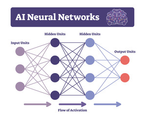

# Alex Towell

- lex@metafunctor.com :email:
- https://metafunctor.com :link:
- https://github.com/queelius :rocket:
- https://twitter.com/queelius :bird:

- URL for this talk: https://github.com/queelius/sluug-talk-llm :link:

---

## Outline of Talk

- Theoretical Background

- Go over a simple language model
    - $n$-gram model (Jupyter Notebook)
    - Easy to understand and helps us understand some aspects of LLMs.

- Show an application of LLMs:
    - Try to make a database search API intelligent (NLP)
    with small LLMs.

- Open Discussion

---

## Good-Old-Fashioned AI (GOFAI)

- Find a way to symbolically represent the problem and
  then use logic or rules to solve it.

    - Programming :computer:

    - Rule-based systems :robot:

    - First-order logic

- LLMs are *good* at using these tools. :hammer:

    - Integrate Prolog with LLM tool-use to help with planning and reasoning?

---
## Reductive Reasoning

GOFAI works for a lot of problems we care about:

- Filter everything through our small working memory.
    - Inductive bias: Makes assumptions about the world.
    - Help us generalize out-of-distribution. :brain:
- Take big problems and break down into simpler problems.
- Solve simpler problems and combine.

---
## Limits of GOFAI

Many problems are hard to break down into simpler parts.

- Whole greater than the sum of its parts.

- Too complex to solve reductively.
    - We can't program computers to do it. :shrug:
    - Identifying cats in pictures? :cat:
    - > The hard problems are easy and the easy problems are hard.
        -- Steven Pinker
    - Playing with legos is hard but multivariate calculus is easy (for a computer).
---
## How Do Our Brains Work?

Brains programmed by evolution to survive in a complex world.

- It's a prediction engine: it learns to predict the world.
- The unconscious mind is not limited by a small "working memory"
- It can do things we don't understand how to do.
- Brain is a black box. (See: *Interpretable ML*)

---

## Machine Learning

:bulb: Let's have the computer learn from data.

- Since the real world is too complex, let's have the computer learn from data like we do.

- There are three main types of learning.

    - Supervised Learning (SL)
    - Unsupervised Learning 
    - Reinforcement Learning (RL)

- _Spoiler_: LLMs use self-supervised learning (SSL) and RL (RLHF).

---

### Type of Learning (1): Supervised Learning

**Learning from labeled data**. We have some input and output data, and we want to learn how to map the input to the output.

- Given an (unknown) function $f$ and a set of input-output pairs $(x, f(x))$, learn a function $\hat{f}$ that approximates $f$ on the input-output pairs.

- E.g., classification: $f : [$:cat: or :dog:$] \mapsto \{$:cat:, :dog:$\}$.

    - Use $\hat{f}$ to predict :cat: or :dog: for new images.

- Easiest problem to solve in ML. But: limited by data.

- **Fine-Tuning** LLMs is supervised learning: improve it on specific labeled tasks.

---
### Type of Learning (2): Unsupervised Learning

**No labeled data**. Learn the underlying structure of the data.

- Clustering: Grouping similar data points. (See: *RAG*)

- Dimensionality Reduction: Learn *efficient* representations of the data.
    - Very hard and one of the most important problems in ML.

- Density Estimation: Stochastic estimate of process that generated the observed data. Say the process generates $(x, y)$ pairs and we estimate its density $\Pr(x, y)$.
    - Classification (supervised): $\Pr(y|x) = \Pr(x, y) / \Pr(x)$

- **Pre-training LLMs** is like unsupervised learning. Learn a good representation and probability distribution of the *raw* text using self-supervised learning (SSL).

---

### Final Type of Learning (3): Reinforcement Learning

This is an agentic approach to learning. Agent interacts with environment and learns from the rewards it receives.
- *Goal*: maximize the expected sum of rewards.
- *Spoiler*: Agentic frameworks that include LLMs as a prediction component is a very active area of research.
- Prediction + Search = Planning
    - Counterfactual reasoning
- Hypothesis: `Compression = Prediction = Intelligence`
- Big reason a lot of people are excited about Sora.
    - Has everyone seen the Sora videos?
    - "Intuitive" world simulation (embedded in the weights of a giant NN).    

---

## Early Failures in ML

Reality is really complicated: $(x_1, x_2, \ldots, x_n)$,
$n$ extremely large, and each $x_i$ is some complex object.

Early efforts in ML were not very successful.

- Overfitting, curse of dimensionality, lack of data/compute.

- To combat lack of data/compute, clever solutions developed.
    - Many of these methods are no longer around.
    > "The biggest lesson that can be read from 70 years of AI research is that general methods that leverage computation are ultimately the most effective, and by a large margin."
        -- Richard Sutton in "The Bitter Lesson": 
---

## Neural Networks

Neural Networks (NN) are one the solutions that stuck around.

- It fell out of favor for a while, but it's back.
- Universal function approximator.
    - Can learn to represent any function.
    - But: need a lot of data to do so and be difficult to train.
- NNs seem to scale to as much data and compute as we can throw at them.

---
## Inductive Bias

Observations may have an infinite set of hypothesis that are compatible with the data.

- **Inductive Bias**: The set of assumptions that the model makes about the data.

- **Occam's Razor**: choose the simplest hypothesis that is compatible with the data. (See _Solomonoff Induction_.)

- Generalizing out-of-distribution (OOD) from inputs not in the training data.

- **Problem**: We are almost *always* out-of-distribution.
    - Except in toy problems (see: early successes)

- Good inductive biases are necessary for generalization.

- **No Free Lunch Theorem**: No model is optimal for all tasks.
---

## Era of Deep Learning

One of the hardest parts is learning sample efficient representation of the data.

- Layers of NN learn progressively higher-level representations: `Pixels -> Edges -> Objects`

- AlexNet (2012) was the first to show that deep learning could work well on large-scale datasets.

---

## Era of Deep Learning (cont.)

DNNs (feed-forward) learn little circuit programs that can generate parts of the training data. (Image stolen from Jeff Dean's slides.)

- Hundreds of layers: can learn pretty complicated programs.

- (What a human can do in a half a second, a DNN can do?)

---
## Era of Generative AI

Generative AI "reverses" the arrows
    - Image to text, image to image, etc.

- They learn something about the data generating process (DGP).
- They have completely changed our expectations of what computers can do.

---
## Era of Generative AI (cont.)

We now have computers that can see, hear, understand, and generate all of these things.

Let's go look at **Sora**: generative video, or world(s) simulator?

- **Scaling**: And increasing the scale (data, compute) increase their capabilities. See: Scaling laws.

    - Need a lot more *compute*.
    - It's going to get wild(er).
    - Hypothesis: `Prediction = Compression = Intelligence`.

---
## Large Language Models (LLMs)

Autoregressive (AR) models learn a probability distribution over training data by using self-supervised learning (SSL):

$$
\Pr\{x_1, x_2, \ldots, x_T\} = \prod_{t=1}^T \Pr\{x_t | x_1, \ldots, x_{t-1}\
$$

- This is hard to learn, but with enough data and compute, a lot seems possible.
- LLMs have a nice advantage since language is designed to have a very low dimensionality and have a high signal to noise ratio.
    - Representation learning is easier in language than in other domains.
        - Still learns representations (`word2vec`)
- **Language** represents much of the things that humans care and think about, so learning to predict it is a kind of general intelligence. (See: Sparks of AGI by Microsoft)

---

## Sampling from LLMs

There are many different ways to sample from LLMs and change the behavior of the model.

- **Temperature**: Rescaling the logits before applying the softmax function.
    - $T = 1$: estimates the probability distribution.
    - $T < 1$: reduces randomness, i.e., more predictable outputs.
    - $T > 1$: increases randomness, i.e., more unpredictable outputs.

Good for controlling *exploitation* vs *exploration* if repeatedly sampling from the model to generate new or different outputs.

- **Top-$k$ and Top-$p$ Sampling**: Choose the top-$k$ or top-$p$ tokens and sample from them.

- **Beam Search**: Explore multiple paths and sample the most likely.

---
## Prompting Strategies

Early models were very sensitive to the prompt.
- Makes sense, they were trained to generate the data.
- If you condition on crazy data, you get crazy outputs.

$$
\Pr\{\text{more crazy}|\text{crazy}\}
$$

Various prompting strategies have been developed to help the model generate more reliable outputs:

    - Chain-of-thought (CoT)
    - Tree-of-thought (ToT)
    - and so on

---

## LLM Overview

- **Task**: Estimate the training data's probability distribution using next-token prediction (SSL)
  - Pre-trained models predict the raw data distribution.
  - Fine-Tuning: Train the model to a specific data that is more relevant to a task.
  - RLHF: Bias the model to produce outputs that people prefer.
- **Goal**: Enable the generation of new data points that resemble in some ways the characteristics the data.
  - At inference, outputs are almost always out-of-distribution (OOD).
  - In-context learning: Transformers seem to be good at learning to generalize from data that was not seen during training.
      - Learning to predict the next token when the data is sufficiently complicated requires a general kind of intelligence.
      - Causal inductive bias: The model is biased to predict the next token based on the evidence of the previous tokens.
          *Example*: "Based on all the previous evidence, I conclude that the murderer is ___". To do this well, it seems you must be able to reason about the evidence.       
 
 ---
## My Naive N-Gram Model

- Let's go to the notebook.
- If you want to follow along, colab is available at:
    - https://colab.research.google.com/drive/1ak4kOtbIQGXE5kuhhGTd55xu4qRpeZd7?usp=sharing
- See my GitHub at https://github.com/queelius/sluug-talk-llm

---
## Tool-Use

There is a lot of training data about how to use tools and APIs.

- Large LLMs like GPT-4 do a good job predicting when and how they should
  use tools.

- Let's go over to the ElasticSearch NLQ demo.

---
## Discussion

